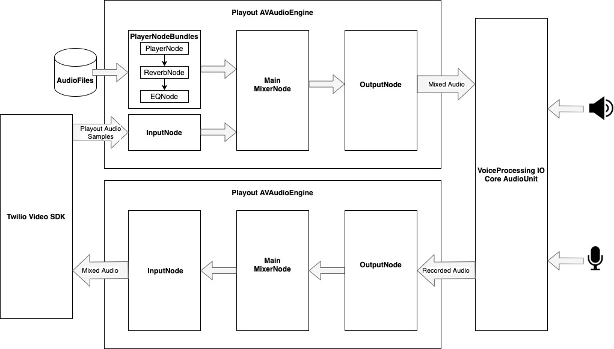

# Contributing Guidelines
If you're interested in contributing to this project, here are a few ways to do so:

### Bug fixes
* If you find a bug, please first report it using [Gitlab issues](https://gitlab.com/twilio-flutter/programmable-video/issues/new).
* Issues that have already been identified as a bug will be labelled ~"type::bug" .
* If you'd like to submit a fix for a bug, send a [Merge Request](https://docs.gitlab.com/ee/user/project/repository/forking_workflow.html#merging-upstream) from your own fork, also read the [How To](#how-to) and [Development Guidelines](#development-guidelines).
* Include a test that isolates the bug and verifies that it was fixed.
* Also update the example and documentation if necessary.

### New Features
* If you'd like to add a feature to the library that doesn't already exist, feel free to describe the feature in a new [Gitlab issue](https://gitlab.com/twilio-flutter/programmable-video/issues/new).
* Issues that have been identified as a feature request will be labelled ~"type::feature".
* If you'd like to implement the new feature, please wait for feedback from the project maintainers before spending too much time writing the code. In some cases, enhancements may not align well with the project objectives at the time.
* Implement your code and please read the [How To](#how-to) and [Development Guidelines](#development-guidelines).
* Also update the example and documentation where needed.

### Documentation & Miscellaneous
* If you think the documentation could be clearer, or you have an alternative implementation of something that may have more advantages, we would love to hear it.
* As always first file a report in a [Gitlab issue](https://gitlab.com/twilio-flutter/programmable-video/issues/new).
* Issues that have been identified as a documentation change will be labelled ~"type::documentation".
* Implement the changes to the documentation, please read the [How To](#how-to) and [Development Guidelines](#development-guidelines).

# Requirements
For a contribution to be accepted:

* Take note of the [Development Guidelines](#development-guidelines)
* Code must follow existing styling conventions
* Commit message should start with a [issue number](#how-to) and should also be descriptive.

If the contribution doesn't meet these criteria, a maintainer will discuss it with you on the issue. You can still continue to add more commits to the branch you have sent the Merge Request from.

# How To
* First of all [file an bug or feature report](https://gitlab.com/twilio-flutter/programmable-video/issues/new) on this repository.
* [Fork the project](https://docs.gitlab.com/ee/gitlab-basics/fork-project.html) on Gitlab
* Clone the forked repository to your local development machine (e.g. `git clone https://gitlab.com/<YOUR_GITLAB_USER>/programmable-video.git`)
* Run `flutter pub get` in the cloned repository to get all the dependencies
* Create a new local branch based on issue number from first step (e.g. `git checkout -b 12-new-feature`)
* Make your changes
* When committing your changes, make sure to start the commit message with `#<issue-number>` (e.g. `git commit -m '#12 - New Feature added'`)
* Push your new branch to your own fork into the same remote branch (e.g. `git push origin 12-new-feature`)
* On Gitlab goto the [merge request page](https://docs.gitlab.com/ee/user/project/repository/forking_workflow.html#merging-upstream) on your own fork and create a merge request to this reposistory

# Development Guidelines
* Backend code for the example app should be written for Cloud Functions, see the `example/firebase` folder.
* Documentation should be updated.
* Example application should be updated.
* Format the Flutter code accordingly.
* Note the [`analysis_options.yaml`](https://gitlab.com/twilio-flutter/programmable-video/-/blob/master/programmable_video/analysis_options.yaml) and write code as stated in this file

# Test generating of `dartdoc`
* On local development make sure the `dartdoc` program is mentioned in your `$PATH`
* `dartdoc` can be found here: `<FLUTTER_INSTALL_DIR>/bin/cache/dart-sdk/bin/dartdoc`
* Generate docs with the following command: `dartdoc --no-auto-include-dependencies --quiet`
* Output will be placed into `doc/api/`

# Communicating between Dart and Native

The communication between Native code and Dart goes via EventChannels. Below you will find a table with all the currently identified events we want to implement and their implementation status.

[Check this link](https://flutter.dev/docs/development/platform-integration/platform-channels?tab=ios-channel-swift-tab#codec) for more information on platform channel data types support and codecs.

### Events table
Reference table of all the events the plugin targets to support and their native platform counter part.

| Type              | Dart Event name              | Android                        | iOS                                     | Implemented  |
| :---------------- | ---------------------------- | ------------------------------ | --------------------------------------- | ------------ |
| LocalParticipant  | audioTrackPublished          | onAudioTrackPublished          | didPublishAudioTrack                    | Yes          |
| LocalParticipant  | audioTrackPublicationFailed  | onAudioTrackPublicationFailed  | didFailToPublishAudioTrack              | Yes          |
| LocalParticipant  | dataTrackPublished           | onDataTrackPublished           | didPublishDataTrack                     | Yes          |
| LocalParticipant  | dataTrackPublicationFailed   | onDataTrackPublicationFailed   | didFailToPublishDataTrack               | Yes          |
| LocalParticipant  | networkQualityLevelChanged   | onNetworkQualityLevelChanged   | networkQualityLevelDidChange            | No           |
| LocalParticipant  | videoTrackPublished          | onVideoTrackPublished          | didPublishVideoTrack                    | Yes          |
| LocalParticipant  | videoTrackPublicationFailed  | onVideoTrackPublicationFailed  | didFailToPublishVideoTrack              | Yes          |
| RemoteDataTrack   | stringMessage                | onMessage                      | didReceiveString                        | Yes          |
| RemoteDataTrack   | bufferMessage                | onMessage                      | didReceiveData                          | Yes          |
| RemoteParticipant | audioTrackDisabled           | onAudioTrackDisabled           | remoteParticipantDidDisableAudioTrack   | Yes          |
| RemoteParticipant | audioTrackEnabled            | onAudioTrackEnabled            | remoteParticipantDidEnableAudioTrack    | Yes          |
| RemoteParticipant | audioTrackPublished          | onAudioTrackPublished          | remoteParticipantDidPublishAudioTrack   | Yes          |
| RemoteParticipant | audioTrackSubscribed         | onAudioTrackSubscribed         | didSubscribeToAudioTrack                | Yes          |
| RemoteParticipant | audioTrackSubscriptionFailed | onAudioTrackSubscriptionFailed | didFailToSubscribeToAudioTrack          | Yes          |
| RemoteParticipant | audioTrackUnpublished        | onAudioTrackUnpublished        | remoteParticipantDidUnpublishAudioTrack | Yes          |
| RemoteParticipant | audioTrackUnsubscribed       | onAudioTrackUnsubscribed       | didUnsubscribeFromAudioTrack            | Yes          |
| RemoteParticipant | dataTrackPublished           | onDataTrackPublished           | remoteParticipantDidPublishDataTrack    | Yes          |
| RemoteParticipant | dataTrackSubscribed          | onDataTrackSubscribed          | didSubscribeToDataTrack                 | Yes          |
| RemoteParticipant | dataTrackSubscriptionFailed  | onDataTrackSubscriptionFailed  | didFailToSubscribeToDataTrack           | Yes          |
| RemoteParticipant | dataTrackUnpublished         | onDataTrackUnpublished         | remoteParticipantDidUnpublishDataTrack  | Yes          |
| RemoteParticipant | dataTrackUnsubscribed        | onDataTrackUnsubscribed        | didUnsubscribeFromDataTrack             | Yes          |
| RemoteParticipant | videoTrackDisabled           | onVideoTrackDisabled           | remoteParticipantDidDisableVideoTrack   | Yes          |
| RemoteParticipant | videoTrackEnabled            | onVideoTrackEnabled            | remoteParticipantDidEnableVideoTrack    | Yes          |
| RemoteParticipant | videoTrackPublished          | onVideoTrackPublished          | remoteParticipantDidPublishVideoTrack   | Yes          |
| RemoteParticipant | vdeoTrackSubscribed          | onVideoTrackSubscribed         | didSubscribeToVideoTrack                | Yes          |
| RemoteParticipant | videoTrackSubscriptionFailed | onVideoTrackSubscriptionFailed | didFailToSubscribeToVideoTrack          | Yes          |
| RemoteParticipant | videoTrackUnpublished        | onVideoTrackUnpublished        | remoteParticipantDidUnpublishVideoTrack | Yes          |
| RemoteParticipant | videoTrackUnsubscribed       | onVideoTrackUnsubscribed       | didUnsubscribeFromVideoTrack            | Yes          |
| Room              | connectFailure               | onConnectFailure               | roomDidFailToConnect                    | Yes          |
| Room              | connected                    | onConnected                    | roomDidConnect                          | Yes          |
| Room              | disconnected                 | onDisconnected                 | roomDidDisconnect                       | Yes          |
| Room              | participantConnected         | onParticipantConnected         | participantDidConnect                   | Yes          |
| Room              | participantDisconnected      | onParticipantDisconnected      | participantDidDisconnect                | Yes          |
| Room              | reconnected                  | onReconnected                  | roomDidReconnect                        | Yes          |
| Room              | reconnecting                 | onReconnecting                 | roomIsReconnecting                      | Yes          |
| Room              | recordingStarted             | onRecordingStarted             | roomDidStartRecording                   | Yes          |
| Room              | recordingStopped             | onRecordingStopped             | roomDidStopRecording                    | Yes          |
| Room              | dominantSpeakerChanged       | onDominantSpeakerChanged       | dominantSpeakerDidChange                | Yes          |

### Twilio exceptions table
Reference table of all the twilio exceptions with their error code and platform labels.

| Android                                             | iOS                                                | Code value       |
|-----------------------------------------------------|----------------------------------------------------|------------------|
| -                                                   | TVIErrorAccessTokenInvalidError                    | `0`              |
| ACCESS_TOKEN_INVALID_EXCEPTION                      | TVIErrorAccessTokenInvalidError                    | `20101`          |
| ACCESS_TOKEN_HEADER_INVALID_EXCEPTION               | TVIErrorAccessTokenHeaderInvalidError              | `20102`          |
| ACCESS_TOKEN_ISSUER_INVALID_EXCEPTION               | TVIErrorAccessTokenIssuerInvalidError              | `20103`          |
| ACCESS_TOKEN_EXPIRED_EXCEPTION                      | TVIErrorAccessTokenExpiredError                    | `20104`          |
| ACCESS_TOKEN_NOT_YET_VALID_EXCEPTION                | TVIErrorAccessTokenNotYetValidError                | `20105`          |
| ACCESS_TOKEN_GRANTS_INVALID_EXCEPTION               | TVIErrorAccessTokenGrantsInvalidError              | `20106`          |
| ACCESS_TOKEN_SIGNATURE_INVALID_EXCEPTION            | TVIErrorAccessTokenSignatureInvalidError           | `20107`          |
| SIGNALING_CONNECTION_ERROR_EXCEPTION                | TVIErrorSignalingConnectionError                   | `53000`          |
| SIGNALING_CONNECTION_DISCONNECTED_EXCEPTION         | TVIErrorSignalingConnectionDisconnectedError       | `53001`          |
| SIGNALING_CONNECTION_TIMEOUT_EXCEPTION              | TVIErrorSignalingConnectionTimeoutError            | `53002`          |
| SIGNALING_INCOMING_MESSAGE_INVALID_EXCEPTION        | TVIErrorSignalingIncomingMessageInvalidError       | `53003`          |
| SIGNALING_OUTGOING_MESSAGE_INVALID_EXCEPTION        | TVIErrorSignalingOutgoingMessageInvalidError       | `53004`          |
| SIGNALING_DNS_RESOLUTION_ERROR_EXCEPTION            | TVIErrorSignalingDnsResolutionError                | `53005`          |
| SIGNALING_SERVER_BUSY_EXCEPTION                     | TVIErrorSignalingServerBusyError                   | `53006`          |
| ROOM_NAME_INVALID_EXCEPTION                         | TVIErrorRoomNameInvalidError                       | `53100`          |
| ROOM_NAME_TOO_LONG_EXCEPTION                        | TVIErrorRoomNameTooLongError                       | `53101`          |
| ROOM_NAME_CHARS_INVALID_EXCEPTION                   | TVIErrorRoomNameCharsInvalidError                  | `53102`          |
| ROOM_CREATE_FAILED_EXCEPTION                        | TVIErrorRoomCreateFailedError                      | `53103`          |
| ROOM_CONNECT_FAILED_EXCEPTION                       | TVIErrorRoomConnectFailedError                     | `53104`          |
| ROOM_MAX_PARTICIPANTS_EXCEEDED_EXCEPTION            | TVIErrorRoomMaxParticipantsExceededError           | `53105`          |
| ROOM_NOT_FOUND_EXCEPTION                            | TVIErrorRoomNotFoundError                          | `53106`          |
| ROOM_MAX_PARTICIPANTS_OUT_OF_RANGE_EXCEPTION        | TVIErrorRoomMaxParticipantsOutOfRangeError         | `53107`          |
| ROOM_TYPE_INVALID_EXCEPTION                         | TVIErrorRoomTypeInvalidError                       | `53108`          |
| ROOM_TIMEOUT_OUT_OF_RANGE_EXCEPTION                 | TVIErrorRoomTimeoutOutOfRangeError	               | `53109`          |
| ROOM_STATUS_CALLBACK_METHOD_INVALID_EXCEPTION       | TVIErrorRoomStatusCallbackMethodInvalidError	   | `53110`          |
| ROOM_STATUS_CALLBACK_INVALID_EXCEPTION              | TVIErrorRoomStatusCallbackInvalidError             | `53111`          |
| ROOM_STATUS_INVALID_EXCEPTION                       | TVIErrorRoomStatusInvalidError	                   | `53112`          |
| ROOM_ROOM_EXISTS_EXCEPTION                          | TVIErrorRoomRoomExistsError	                       | `53113`          |
| ROOM_INVALID_PARAMETERS_EXCEPTION                   | TVIErrorRoomInvalidParametersError	               | `53114`          |
| ROOM_MEDIA_REGION_INVALID_EXCEPTION                 |	TVIErrorRoomMediaRegionInvalidError                | `53115`          |
| ROOM_MEDIA_REGION_UNAVAILABLE_EXCEPTION             |	TVIErrorRoomMediaRegionUnavailableError            | `53116`          |
| ROOM_SUBSCRIPTION_OPERATION_NOT_SUPPORTED_EXCEPTION |	TVIErrorRoomSubscriptionOperationNotSupportedError | `53117`          |
| ROOM_ROOM_COMPLETED_EXCEPTION                       |	TVIErrorRoomRoomCompletedError	                   | `53118`          |
| ROOM_ACCOUNT_LIMIT_EXCEEDED_EXCEPTION               |	TVIErrorRoomAccountLimitExceededError   	       | `53119`          |
| PARTICIPANT_IDENTITY_INVALID_EXCEPTION              |	TVIErrorParticipantIdentityInvalidError            | `53200`          |
| PARTICIPANT_IDENTITY_TOO_LONG_EXCEPTION             |	TVIErrorParticipantIdentityTooLongError	           | `53201`          |
| PARTICIPANT_IDENTITY_CHARS_INVALID_EXCEPTION        |	TVIErrorParticipantIdentityCharsInvalidError       | `53202`          |
| PARTICIPANT_MAX_TRACKS_EXCEEDED_EXCEPTION           |	TVIErrorParticipantMaxTracksExceededError   	   | `53203`          |
| PARTICIPANT_NOT_FOUND_EXCEPTION                     |	TVIErrorParticipantNotFoundError                   | `53204`          |
| PARTICIPANT_DUPLICATE_IDENTITY_EXCEPTION            |	TVIErrorParticipantDuplicateIdentityError	       | `53205`          |
| PARTICIPANT_ACCOUNT_LIMIT_EXCEEDED_EXCEPTION        |	TVIErrorParticipantAccountLimitExceededError       | `53206`          |
| PARTICIPANT_INVALID_SUBSCRIBE_RULE_EXCEPTION        |	TVIErrorParticipantInvalidSubscribeRuleError       | `53215`          |
| TRACK_INVALID_EXCEPTION                             |	TVIErrorTrackInvalidError                          | `53300`          |
| TRACK_NAME_INVALID_EXCEPTION                        |	TVIErrorTrackNameInvalidError                      | `53301`          |
| TRACK_NAME_TOO_LONG_EXCEPTION                       |	TVIErrorTrackNameTooLongError                      | `53302`          |
| TRACK_NAME_CHARS_INVALID_EXCEPTION                  |	TVIErrorTrackNameCharsInvalidError                 | `53303`          |
| TRACK_NAME_IS_DUPLICATED_EXCEPTION                  |	TVIErrorTrackNameIsDuplicatedError                 | `53304`          |
| TRACK_SERVER_TRACK_CAPACITY_REACHED_EXCEPTION       |	TVIErrorTrackServerTrackCapacityReachedError       | `53305`          |
| TRACK_DATA_TRACK_MESSAGE_TOO_LARGE_EXCEPTION        |	TVIErrorTrackDataTrackMessageTooLargeError         | `53306`          |
| TRACK_DATA_TRACK_SEND_BUFFER_FULL_EXCEPTION         |	TVIErrorTrackDataTrackSendBufferFullError          | `53307`          |
| MEDIA_CLIENT_LOCAL_DESC_FAILED_EXCEPTION            |	TVIErrorMediaClientLocalDescFailedError            | `53400`          |
| MEDIA_SERVER_LOCAL_DESC_FAILED_EXCEPTION            |	TVIErrorMediaServerLocalDescFailedError            | `53401`          |
| MEDIA_CLIENT_REMOTE_DESC_FAILED_EXCEPTION           |	TVIErrorMediaClientRemoteDescFailedError           | `53402`          |
| MEDIA_SERVER_REMOTE_DESC_FAILED_EXCEPTION           |	TVIErrorMediaServerRemoteDescFailedError           | `53403`          |
| MEDIA_NO_SUPPORTED_CODEC_EXCEPTION                  |	TVIErrorMediaNoSupportedCodecError                 | `53404`          |
| MEDIA_CONNECTION_ERROR_EXCEPTION                    |	TVIErrorMediaConnectionError                       | `53405`          |
| MEDIA_DATA_TRACK_FAILED_EXCEPTION                   |	TVIErrorMediaDataTrackFailedError	               | `53406`          |
| MEDIA_DTLS_TRANSPORT_FAILED_EXCEPTION               |	TVIErrorMediaDtlsTransportFailedError	           | `53407`          |
| MEDIA_ICE_RESTART_NOT_ALLOWED_EXCEPTION             |	TVIErrorMediaIceRestartNotAllowedError             | `53408`          |
| CONFIGURATION_ACQUIRE_FAILED_EXCEPTION              |	TVIErrorConfigurationAcquireFailedError	           | `53500`          |
| CONFIGURATION_ACQUIRE_TURN_FAILED_EXCEPTION         |	TVIErrorConfigurationAcquireTurnFailedError	       | `53501`          |

### AVAudioEngineDevice Architecture

Below is a rough architectural diagram of the audio pipeline constructed and managed by the `AVAudioEngineDevice` (which is an opt-in feature).

Of note, `PlayerNodeBundles` are managed by the `AVAudioPlayerNodeManager`, which is utilized internally by the `AVAudioEngineDevice`.

